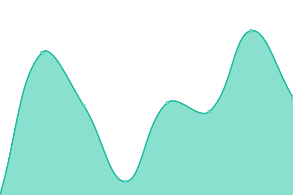
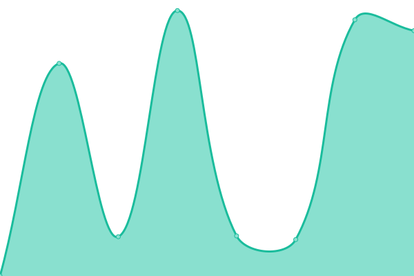

# [📈 Live Status](https://lburling.github.io/statuspage): <!--live status--> **🟩 All systems operational**

This repository contains the open-source uptime monitor and status page for [Gang](https://lburling.github.io/statuspage/)

With [Upptime](https://upptime.js.org), you can get your own unlimited and free uptime monitor and status page, powered entirely by a GitHub repository. We use [Issues](https://github.com/lburling/statuspage/issues) as incident reports, [Actions](https://github.com/lburling/statuspage/actions) as uptime monitors, and [Pages](https://lburling.github.io/statuspage) for the status page.

<!--start: status pages-->
<!-- This summary is generated by Upptime (https://github.com/upptime/upptime) -->
<!-- Do not edit this manually, your changes will be overwritten -->
<!-- prettier-ignore -->
| URL | Status | History | Response Time | Uptime |
| --- | ------ | ------- | ------------- | ------ |
|  [www.sanger.ac.uk](https://www.sanger.ac.uk) | 🟩 Up | [www-sanger-ac-uk.yml](https://github.com/lburling/statuspage/commits/HEAD/history/www-sanger-ac-uk.yml) | 

 3597ms
     
 | 

<a href="https://lburling.github.io/statuspage/history/www-sanger-ac-uk">100.00%</a>
    

|  [Sanger Email](https://email.sanger.ac.uk) | 🟩 Up | [sanger-email.yml](https://github.com/lburling/statuspage/commits/HEAD/history/sanger-email.yml) | 

 2333ms
     
 | 

<a href="https://lburling.github.io/statuspage/history/sanger-email">100.00%</a>
    

<!--end: status pages-->
